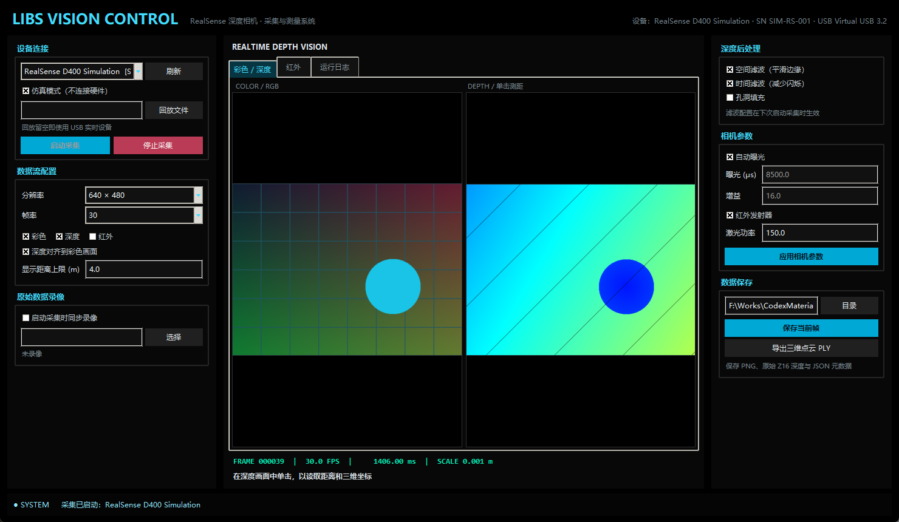

# LIBS 深度相机上位机

面向 RealSense D400 系列、基于 SDK 2.58.1 的 Windows 桌面控制软件。界面沿用项目中位移平台上位机的黑底青色工业控制风格，采集线程与 Tkinter 界面线程相互隔离。



## 已实现功能

- RealSense USB 设备枚举，显示型号、序列号、固件和 USB 类型
- 无硬件仿真模式，可预览、测距、截图和导出模拟点云
- 彩色、Z16 深度和红外流独立启用，分辨率及 FPS 配置
- 深度对齐至彩色画面
- 空间滤波、时间滤波和孔洞填充
- 点击彩色原始图或深度图读取对应深度，并通过相机内参反投影为 X/Y/Z 三维坐标
- 深度三维点云实时预览，支持鼠标拖动旋转、滚轮缩放和 X/Y/Z 方向指示
- 自动曝光、曝光、增益、红外发射器和激光功率控制（设备支持时生效）
- 保存彩色/伪彩深度/红外 PNG、16 位原始深度 PNG 和 JSON 元数据
- 导出 PLY 三维点云
- SDK 原始录像和 `.db3` / `.bag` 回放
- 相机断开、流配置不受支持、无效深度、参数越界等异常提示

## 安装与运行

Windows 10/11 x64，推荐使用本资料包已验证的 Python 3.14 x64。

1. 双击 `install.bat`。脚本会在软件目录创建隔离的 `.venv`，并优先从软件自带的离线 wheel 安装 NumPy、Pillow 和 RealSense 2.58.1 Python 绑定。
2. 双击 `run.bat` 启动软件。
3. 初次使用保持“仿真模式”勾选，确认界面、测距和保存流程正常。
4. 实机使用前安装上一级 `01-SDK与工具/RealSense.SDK-WIN10-2.58.1.10581.exe`，将相机接到 USB 3.x 端口，并先用 RealSense Viewer 验证设备。

也可在 PowerShell 中运行：

```powershell
.\.venv\Scripts\python.exe main.py
```

## 实机操作

1. 取消“仿真模式”，点击“刷新”，选择序列号对应的设备。
2. 选择数据流、分辨率和 FPS。并非每种相机都支持列表中所有组合；启动失败时请先尝试 `640 × 480 / 30 FPS`。
3. 点击“启动采集”。画面稳定后，可点击彩色原始图或深度图测距；彩色图定位需要启用“深度对齐到彩色画面”。
4. 切换到“深度三维”标签页可查看当前帧点云；按住鼠标左键拖动旋转，滚轮缩放，双击恢复默认视角。
5. 修改相机参数后点击“应用相机参数”。参数范围由具体型号和当前传感器决定，超出范围会被 SDK 拒绝。
6. “保存当前帧”会将同一时刻的可见图像、Z16 深度和采集元数据保存到输出目录。
7. 如需原始录像，请在启动采集前勾选录像；停止采集后文件才会完整封装。

## 坐标与数据说明

- 距离和三维坐标单位均为米。
- RealSense 相机坐标系：X 向右、Y 向下、Z 向前。
- 原始深度图为 16 位 PNG；像素值乘 JSON 中的 `depth_scale_m` 得到米。
- 开启对齐后，深度像素对应彩色画面坐标；不开启时使用深度相机自身坐标。
- `.db3` 是 SDK 2.58.1 文档中的 ROS 2/SQLite 录像格式；`.bag` 用于兼容旧版资料和回放文件。

## 测试

```powershell
.\.venv\Scripts\python.exe -m unittest discover -s tests -v
```

测试不需要连接真实相机。

## 安全与性能提示

- 不要在未确认型号和兼容表时升级固件。
- 高分辨率、多路流和多个滤波器会增加 USB 带宽与 CPU 占用；出现掉帧时先降低 FPS 或分辨率。
- 软件测距精度受相机型号、工作距离、纹理、反光、环境红外和标定状态影响，不应直接作为安全联锁依据。
